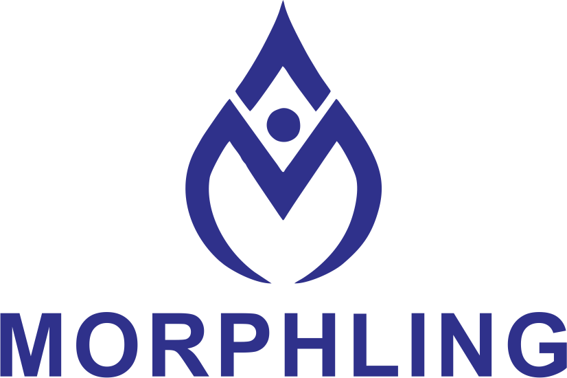
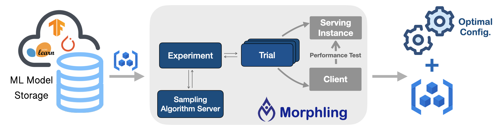
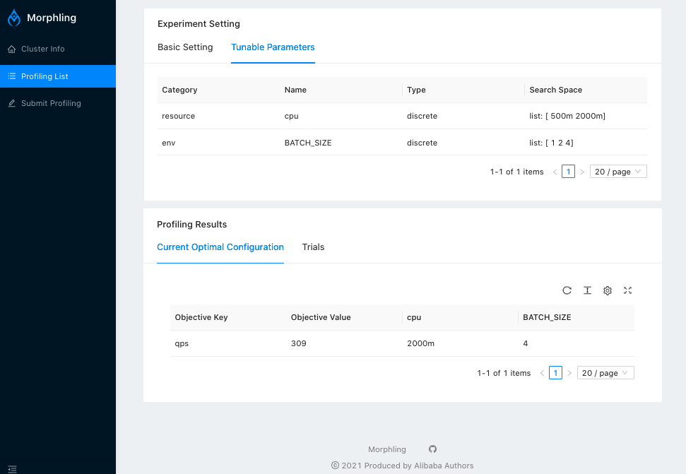

# Morphling

<h1 align="center">
    
</h1>

Morphling is an auto-configuration framework for
machine learning model serving (inference) on Kubernetes.  Check the [website](http://kubedl.io/tuning/intro/) for details.

Morphling paper accepted at ACM Socc 2021:  
**Morphling: Fast, Near-Optimal Auto-Configuration for Cloud-Native Model Serving**
## Overview

Morphling tunes the optimal configurations for your ML/DL model serving deployments.
It searches the best container-level configurations (e.g., resource allocations and runtime parameters) by empirical trials, where a few configurations are sampled for performance evaluation. 



## Features
Key benefits include:

- Automated tuning workflows hidden behind simple APIs.
- Out of the box ML model serving stress-test clients.
- Cloud agnostic and tested on [AWS](https://aws.amazon.com/), [Alicloud](https://us.alibabacloud.com/), etc. 
- ML framework agnostic and generally support popular frameworks, including [TensorFlow](https://github.com/tensorflow/tensorflow), [PyTorch](https://github.com/pytorch/pytorch), etc. 
- Equipped with various and customizable hyper-parameter tuning algorithms.  

## Getting started

### Install using Yaml files

#### Install CRDs

From git root directory, run

```commandline
kubectl apply -f config/crd/bases
```


#### Install Morphling Components
     
 ```commandline
 kubectl create namespace morphling-system
 
 kubectl apply -f manifests/configmap
 kubectl apply -f manifests/controllers
 kubectl apply -f manifests/pv
 kubectl apply -f manifests/mysql-db
 kubectl apply -f manifests/db-manager
 kubectl apply -f manifests/ui
 kubectl apply -f manifests/algorithm
 ```
By default, Morphling will be installed under `morphling-system` namespace.

The official Morphling component images are hosted under [docker hub](https://hub.docker.com/r/kubedl).

Check if all components are running successfully:
```commandline
kubectl get deployment -n morphling-system
```

Expected output:
```commandline
NAME                         READY   UP-TO-DATE   AVAILABLE   AGE
morphling-algorithm-server   1/1     1            1           34s
morphling-controller         1/1     1            1           9m23s
morphling-db-manager         1/1     1            1           9m11s
morphling-mysql              1/1     1            1           9m15s
morphling-ui                 1/1     1            1           4m53s
```

#### Uninstall Morphling controller

```bash
bash script/undeploy.sh
```

#### Delete CRDs
```bash
kubectl get crd | grep morphling.kubedl.io | cut -d ' ' -f 1 | xargs kubectl delete crd
```

### Install using Helm chart
#### Install Helm

Helm is a package manager for Kubernetes. A demo installation on MacOS:

```bash
brew install helm
```

Check the [helm website](https://helm.sh/docs/intro/install/) for more details.

#### Install Morphling

From the root directory, run

```bash
helm install morphling ./helm/morphling --create-namespace -n morphling-system
```

You can override default values defined in [values.yaml](https://github.com/alibaba/morphling/blob/main/helm/morphling/values.yaml) with `--set` flag.
For example, set the custom cpu/memory resource:

```bash
helm install morphling ./helm/morphling --create-namespace -n morphling-system  --set resources.requests.cpu=1024m --set resources.requests.memory=2Gi
```

Helm will install CRDs and other Morphling components under `morphling-system` namespace.

#### Uninstall Morphling

```bash
helm uninstall morphling -n morphling-system
```

#### Delete all morphling CRDs

```bash
kubectl get crd | grep morphling.kubedl.io | cut -d ' ' -f 1 | xargs kubectl delete crd
```

## Morphling UI
Morphling UI is built upon [Ant Design](https://ant.design/).

If you are installing Morphling with Yaml files, from the root directory, run
```bash
kubectl apply -f manifests/ui
```

Or if you are installing Morphling with Helm chart, Morphling UI is automatically deployed.



Check if all Morphling UI is running successfully:
```commandline
kubectl -n morphling-system get svc morphling-ui
```

Expected output:
```commandline
NAME           TYPE       CLUSTER-IP     EXTERNAL-IP   PORT(S)        AGE
morphling-ui   NodePort   10.96.63.162   <none>        9091:30680/TCP   44m
```

If you are using minikube, you can get access to the UI with port-forward:
```commandline
kubectl -n morphling-system port-forward --address 0.0.0.0 svc/morphling-ui 30263:9091
```
Then you can get access to the ui at http://localhost:30263/.

For detailed UI deployment and developing guide, please check [UI.md](https://github.com/alibaba/morphling/blob/main/console/README.md)

## Running Examples

This example demonstrates how to tune the configuration for a [mobilenet](https://www.tensorflow.org/api_docs/python/tf/keras/applications/mobilenet) model deployed with [Tensorflow Serving](https://www.tensorflow.org/tfx/guide/serving) under Morphling.

For demonstration, we choose _two_ configurations to tune: 
the first one the CPU cores (resource allocation), and the second one is maximum serving batch size (runtime parameter). 
We use grid search for configuration sampling.

#### Submit the configuration tuning experiment

```bash
kubectl -n morphling-system apply -f https://raw.githubusercontent.com/alibaba/morphling/main/examples/experiment/experiment-mobilenet-grid.yaml
```

#### Monitor the status of the configuration tuning experiment
```bash
kubectl get -n morphling-system pe
kubectl describe -n morphling-system pe
```
#### Monitor sampling trials (performance test)
```bash
kubectl -n morphling-system get trial
```

#### Get the searched optimal configuration
```bash
kubectl -n morphling-system get pe
```

Expected output:
```bash
NAME                        STATE       AGE   OBJECT NAME   OPTIMAL OBJECT VALUE   OPTIMAL PARAMETERS
mobilenet-experiment-grid   Succeeded   12m   qps           32                     [map[category:resource name:cpu value:4] map[category:env name:BATCH_SIZE value:32]]
```

#### Delete the tuning experiment

```bash
kubectl -n morphling-system delete pe --all
```

##  Workflow
See [Morphling Workflow](./docs/workflow-design.md) to check how Morphling tunes ML serving 
configurations automatically in a Kubernetes-native way.

## Developer Guide

#### Build the controller manager binary

```bash
make manager
```
#### Run the tests

```bash
make test
```
#### Generate manifests, e.g., CRD, RBAC YAML files, etc.

```bash
make manifests
```
#### Build the component docker images, e.g., Morphling controller, DB-Manager

```bash
make docker-build
```

#### Push the component docker images

```bash
make docker-push
```

To develop/debug Morphling controller manager locally, please check the [debug guide](./docs/debug_guide.md).

## Community

If you have any questions or want to contribute, GitHub issues or pull requests are warmly welcome.
