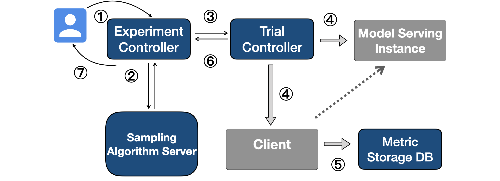
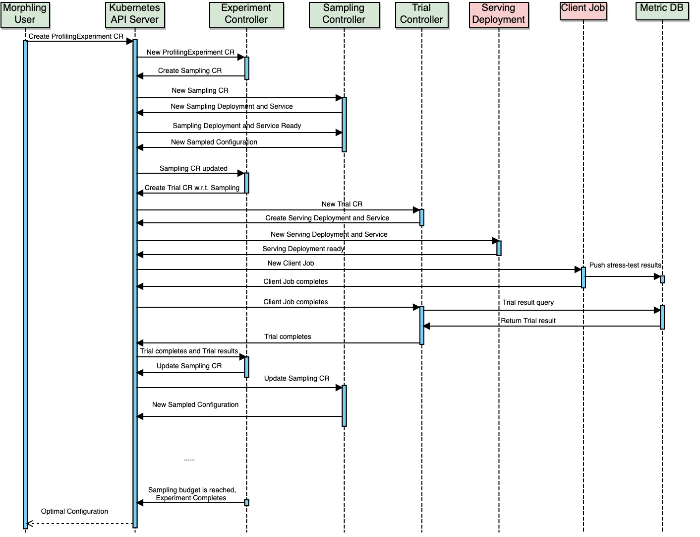

# Morphling APIs and Workflow

## APIs

Morphling requires users to specify the ProflingExperiment interface for configuration tuning, 
including: 

1. ML model container (e.g., the Pod template), 

2. performance objective function, 

3. tunable configuration parameters with types and search range, 

4. sampling algorithms, 

5. sampling budget.

```go
   type ProfilingExperimentSpec struct {

   	ServicePodTemplate corev1.PodTemplate `json:"servicePodTemplate,omitempty"`

   	Objective ObjectiveSpec `json:"objective,omitempty"`   

   	TunableParameters []ParameterCategory `json:"tunableParameters,omitempty"`

   	Algorithm AlgorithmSpec `json:"algorithm,omitempty"`

   	MaxNumTrials *int32 `json:"maxNumTrials,omitempty"`
   }
   ```

## Workflow

The ProflingExperiment workflow looks as follows:



1. A user submits a `ProflingExperiment` via a RPC or front-end UI interface, specifying the ML model, tunable configuration parameters, optimization objectives, and sampling budgets.

2. Within the sampling budget, Morphling iteratively communicates with the algorithm server to get the next configuration for sampling.

3. Then Morphling starts a `Trial` to evaluate that sampling. 

4. When performing a `Trial`, a model serving inference instance `Deployment` is launched, and its “readiness” is reported to trigger a client-side RPS stress-test `Job`. 

5. After the client `Job` completes, the measured peak RPS is stored in the `DB`.

6. A `Trial` finishes, and the result is sent to the `ProflingExperiment`. 

7. The `ProflingExperiment` completes when the sampling budget is reached.


## Sequence Diagram

The sequence diagram of the ProflingExperiment workfolow is shown as follows:

